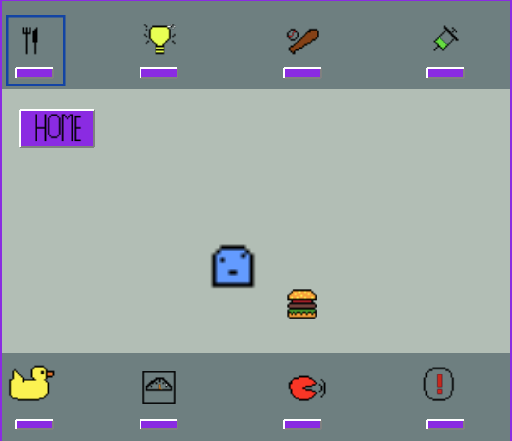
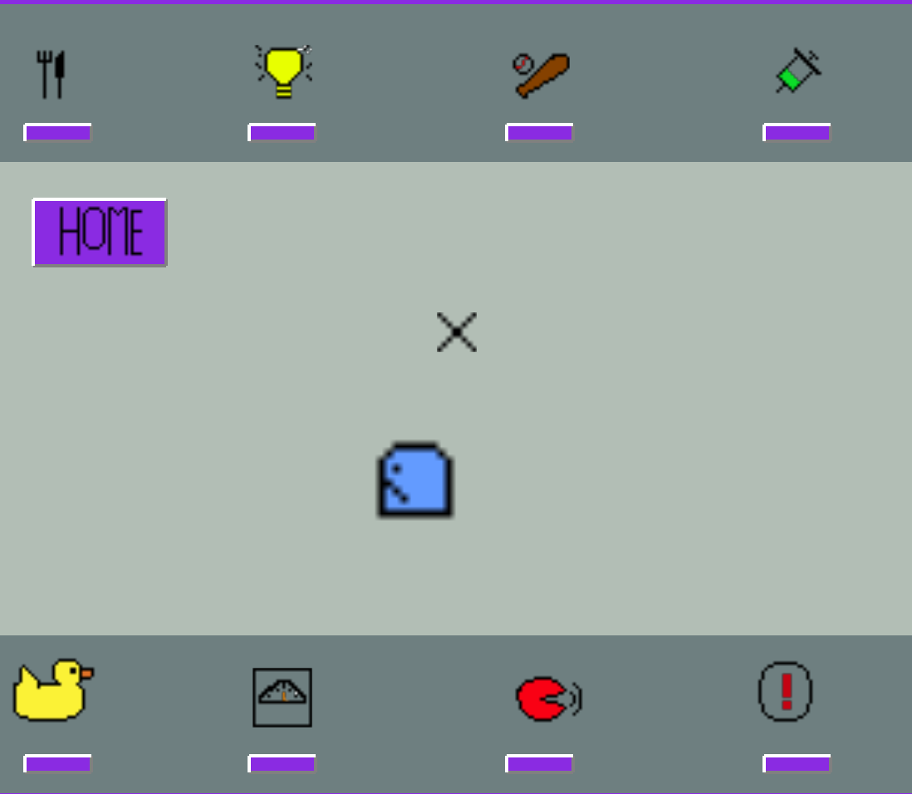
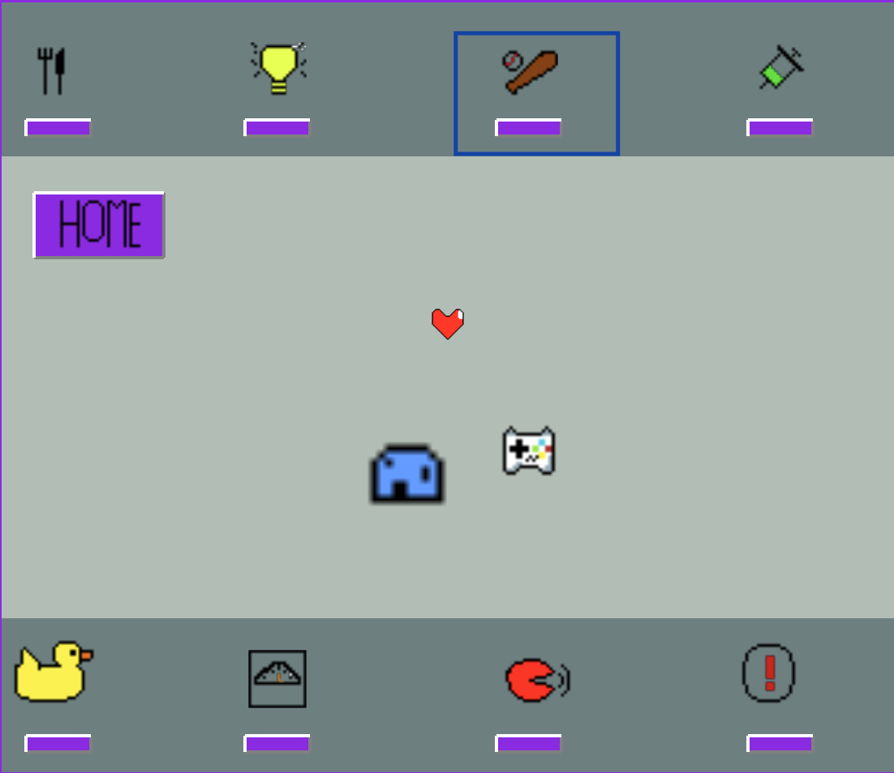
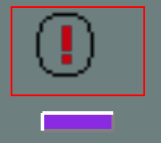
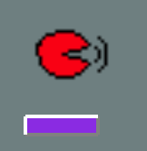
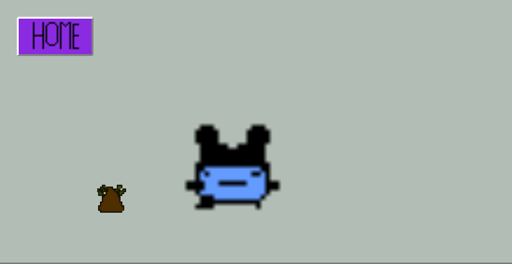
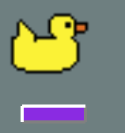
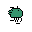

# Hatchlings
 
## Project Overview
Thinking about getting a pet during quarantine, but worried about the increase in responsibility? Look no further than Hatchlings-The Virtual Pet game that allows you to adopt one of three unique creatures each playthrough.

Each Hatchling starts as a small, colorful ball of energy. As the game progresses, your hatchling will evolve into one of three distinct species. Your Hatchling will grow very quickly, so you have to make sure to take good care of it by providing food, rest and letting it play a game to entertain itself.

Your Hatchling loves your attention, and will request it if it is hungry, bored, sick, or if it soils its tank. Hatchlings are very impatient, and will be sure to call you until you attend to their needs and dismiss their request for attention. Like any creature, you must train your Hatchling to only call you when it needs you, providng discipline for unnecessary calls.

Hatchlings hang around their tanks until they are grown. Although they have three unique ways of growing up, they all eventually end up looking quite similar once they are ready to leave the tank and return to the world wide web. Once they decide to leave, they will provide you with a score of how well you cared for them, encouraging you to provide even better care for your next Hatchling!

## Getting Started

### Installing
The below instructions require installation of `pipenv`. To install pipenv via pip:

`pip install pipenv`

From the terminal, navigate to the `KTGames` directory: `/game-jam-2020/KTGames`. Once there, run the following command:

`pipenv install`

This will set up the virtual environment Hatchlings requires to run.

### Run the Game
To launch Hatchlings, navigate inside the `Hatchlings` directory: `/game-jam-2020/KTGames/Hatchlings` from the terminal. Once inside the `Hatchlings` directory, run the following command:

`pipenv run start`

This will launch the opening game window:

## How to Play

Click **Start** to receive a pet Hatchling. You can click **Reset** at any time to start over with a new Hatchling. Each game will surpise you with one of three possible species. The panels in the blue boxes have buttons to help you care for your pet. You can click them any time to change menus, or click **Home** to return to your pet's main screen:

Congratulations! You are now the proud owner of a Hatchling!

You'll notice that your Hatchling likes to bounce around a lot! If you think it needs to rest, hit the **light button** on the top panel to turn off the lights and let your Hatchling sleep:

To check on your Hatchling's health, click on the **scale button**. Here, you can see your Hatchling's hunger level and mood:

It looks like our Hatchling is hungry and not in a great mood, to feed the Hatchling, click on the **fork and knife button**:

A Hatchling will eat until it is full:

To improve your Hatchling's mood, let it play a game by clicking on the **game button**:

Ahhh, what is that noise?! Hatchlings love attention. You can tell your Hatchling wants your attention when the **attention button** is highlighted with a red box and it starts to call for you:

Hitting the attention button will silence the cry, however your Hatchling will cry again quickly if it needs something that you did not provide it with.

Hatchlings grow pretty quickly. Growing is exhuasting and takes a toll on their health, so you will notice parts in the game where they seem impossible to fill up, keep happy, or they just keep getting sick! These are great opportunities to provide them with great care to improve your care score!

You must teach your Hatchling discipline to only ask for attention when they need it! If your Hatchling is full, in a good mood, healthy and has a clean habitat, you must teach them to not request your attention. Do this by clicking the **discipline button** on the bottom panel:

)

Then, click the **attention button** to clear the notification:

A well disciplined Hatchling receives a higher care score at the end of the game, but disciplining a hatchling that calls for a valid reason will lower your care score.

Hatchlings typically have a lot of energy, but if your Hatchling slows down and looks sick, use the **medicine button** to make it feel better:

Finally, like all creatures, your Hatchling will have to use the restroom, making its habitat dirty:

Hit the **flush button** on the bottom panel to clean your Hatchling's tank:

Eventually, all Hatchlings return to the wild after they are grown, providing you with a score of how well you took care of them:

But you can always click **Reset**, then **Start** to hatch a new one and play again!

### Three of a Kind - Hatchling Character Growth Charts

##### 1. Mouse Creature

##### 2. Duck Creature

##### 3. Sea Creature

## Built With
* [Arcade Library](https://arcade.academy/) - Built on top of Pyglet and OpenGL
* Python 3.7.0

## Authors
  * [Katie O'Halloran](https://www.linkedin.com/in/katherine-o-halloran-23bb7181/) - Self-taught developer, Finance/Analytics professional

## Game Asset Sources
All Game Assets for Hatchlings were self-created by the author, leveraging the following tools:

* **Pixel Art/Animations** - [Asperite](https://www.aseprite.org/)
* **Sound Effects** - [Garage Band](https://www.apple.com/mac/garageband)

## Special Thanks
* **Paul Craven** for the [Arcade Library Development](https://github.com/pvcraven/arcade), [excellent documentation](https://arcade.academy/) and the [great tutorials](https://arcade-book.readthedocs.io/en/latest/chapters/index.html)
* **Talk Python to Me Podcast** for the great [episode with Paul](https://talkpython.fm/episodes/show/223/fun-and-easy-2d-games-with-python) on the Arcade libary
