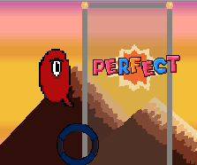

# 3 Keys on the Run

## Presentation
3 Keys on the Run is a game realised with arcade python in the context of [pydis game jam 2020](https://pythondiscord.com/pages/events/game-jam-2020/).
The theme was '3 of a kind'


You only need 3 keys to play this game, Q, W and E ( A, Z and E for french keyboards).
The goal of the game is to hit the correct key, when the circle is in the valid grey zone.



*Depending on where you hit, you can get "Ok", "Super" and "PERFECT"*

Chaining corrects inputs raise your combo meter, the higher the combo meter is, the more point you gain for each input!
Be wary, missing a circle, or having false input reset your combo to 0 and you lose a life orb. You start with 5 lives and
once they reach 0, it's GAME OVER. There is 3 levels of difficulty, triggered when you reach a certain score, making the
circle faster. 


If you have a GAME OVER, you are directed toward the High Score screen. If you are among the best, 
you have the opportunity to enter 3 letters to commemorate your achievment. Try to be **#1**!

## Installation 

Installation is simple, first clone this repo and install the required libraries with this command, in your terminal:

```pip install requirement.txt```

Once you've done that, just launch the game with this command, still in your terminal:

```python game.py``` or ``python3 game.py``

## Credits
- Music is [It Feels Good to be alive by Loyalty Freak Music](https://freemusicarchive.org/music/Loyalty_Freak_Music) (CC0).
You can find their website [here](https://loyaltyfreakmusic.com/).

- All Arts were drawn by me with the help of [Pixel Studio](https://store.steampowered.com/app/1204050/Pixel_Studio_for_pixel_art/) 
(free on Steam).

- Font used in Pixel Studio is FieldGuide by rarelikeunicorn (CC BY 4.0).

- About inspiration for the top part, I took Yoshi Island, the middle part I googled pixel art city and look at images, 
for the last panel I just wanted a space effect, and seen one similar in Neptunia Shooter.
For the letters in the various "ok", "miss", "super", they were redrawn based on a Super Mario Bross 3 font image i
looked up [there](https://www.supermariobrosx.org/forums/viewtopic.php?t=16186) by BMATSANTOS.