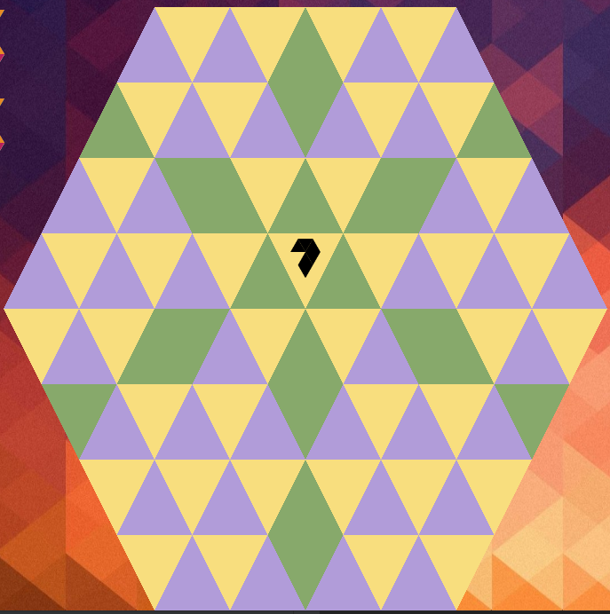
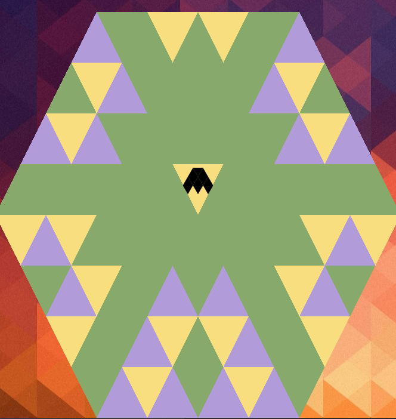
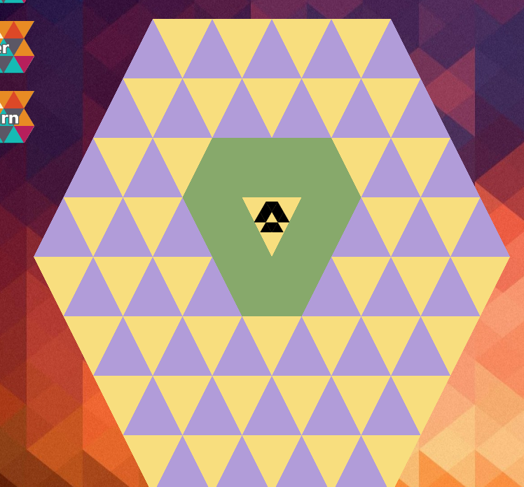

##TriChess 
TriChess is a varient of the classic game of chess except played on a triangular grid. 
Rather than the traditional rows and columns this game is played on three diagonals making for new and interesting board configuration and piece movements

The game can be played with two players or three depending on the board configuration

Hex board (2 player):  
  
Tri board (3 player):     
  

###Game rules
TriChess uses the same pieces as regular chess with familiar but different movesets to regular chess.


Because a triangle can be oriented up or down some pieces have different movesets depending on coordinate location
below the green shows possible movement and red shows attack (for pawn)
Pawn:  
  
Rook:  
  
Bishop:  
  
Knight:  
  
Queen:  
   
King:  
  
 
###Installation
Simply git clone the project with:
```
git clone https://github.com/kkawabat/game-jam-2020.git
```
Then cd into the TriChess directory and run:
```
pipenv install
```
See [pipenv](https://github.com/pypa/pipenv) github page if pipenv is not installed on your system

###Running the game
run the following command in the commandline inside of TriChess directory:
```python main.py```