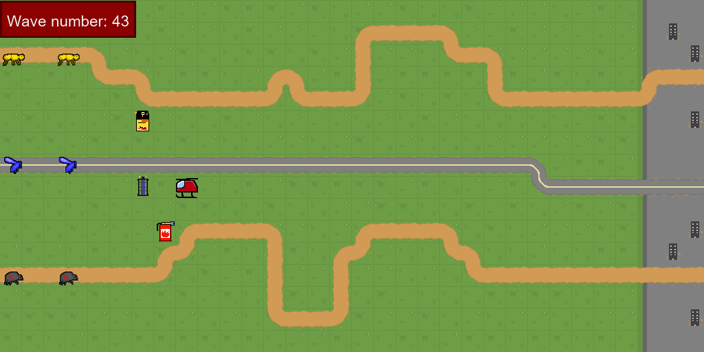

### Beanoculars' submission for the python-discord game jam 2020
---

---
> Insane Irradiated Insects, made by sachapomme (Sacha#8175)

## About
This game was made for the Python Discord Game Jam 2020. The theme was "Three of a kind" and the participants had 10 days to do the best game possible, using the arcade library.

## Concept
The idea was to make a tower defense game, where you only have three towers that you have to replace during the rounds to defeat the three types of mutant bugs that want to destroy the city, coming from the three paths available. You play as a helicopter which must grab the towers and put them near their favorite type of insect to destroy, optimizing your travels and the use of your turrets. The first 50 waves of enemies are pre-made, and after that point, they are generated with by a function, being harder and harder.

## Screenshots

## Setup
Once you have a virtual environnement with pipenv, you should be able to run the game easily on Windows by using these commands:
`pipenv install` to install the depedencies of the project,
`pipenv run start` to run the game
It's my first time using pipenv and github, I really hope that this works, otherwise I'd be thankful if you messaged me on discord: 
Sacha#8175. 
