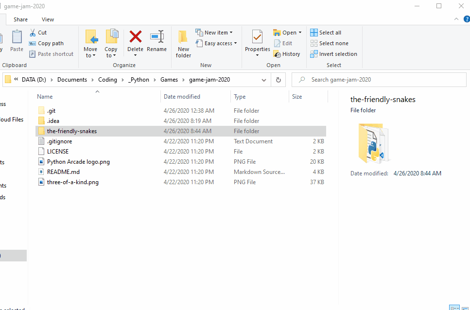

# Flimsy Billy's Coin Dash 3: Super Tag 3 Electric Tree
Welcome to the famed FLimsy Billy's Coin Dash! This is a silly game where you battle against time to collect 50 coins, but 1 coin
disappears from your inventory every second! Explore the different parts of the map and buy exciting potions! But, 
beware, choose the wrong door when you leave the mysterious Jungle Room and you will lose half of your coins! Use the
potions wisely. Sometimes it is more efficient to use the potions. 

**For how to play and installation instructions read below.**

### Installation
To download and install *Flimsy Billy's Coin Dash 3: Super Tag 3 Electric Tree* there are a few simple steps that you
must follow.
1) Download *Flimsy Billy's Coin Dash 3: Super Tag 3 Electric Tree* by clicking the green *Clone or download* button on
[the main page of this project](https://github.com/CodeForeverAndEver/game-jam-2020). Then click `Download Zip`. Then
create a new folder titled anything you want (maybe *Flimsy Billy's Coin Dash 3: Super Tag 3 Electric Tree*?). Double 
click on the zip-folder you downloaded and drag and drop all of the files and `the-friendly-snakes` folder into the other 
folder that you just created.
2) Open up a terminal by clicking `Win + R` (Windows Button + R) and then typing `cmd` and pressing `Enter`. Then, install `pipenv` by typing
`pip install pipenv` in the terminal you just opened and then pressing enter `Enter`. You can close this window.
3) Open the `the-friendly-snakes` folder that is inside of the folder you made above. Click in the top bar and type `cmd`
and then click `Enter`. It looks like this: 
4) In that terminal type: `pipenv sync && pipenv run game` and there you go! The game will be up and running. From now on,
any time that you want to play in the future you only have to type `pipenv run game` for this last step!
5) Enjoy *Flimsy Billy's Coin Dash 3: Super Tag 3 Electric Tree*!

### How To Play
To play *Flimsy Billy's Coin Dash 3: Super Tag 3 Electric Tree* you must control Flimsy Billy around the game world
with the `W` `A` `S` and `D` keys. When you click play you are loaded into the Bar Round. Here you set the bar
for the next round. Try to get as many coins as possible in as small amount of time as possible. When you are done,
go to the portal at the top left of the shop and travel through to the next round. In this round you will have to get
more coins than in the last round, but in the same amount of time. If you can, you win! If you can't, you lose. Try
out potions, some will allow you to get to coins that you haven't before, or some will make other places easier
to get the coins from. There is even a potion that takes you to a secret room. Note: every 5 seconds you lose 1 coin!

### Adhering to the theme
I adhered to this awesome theme by:
* Implementing three types of coins
* Implementing three types of potions